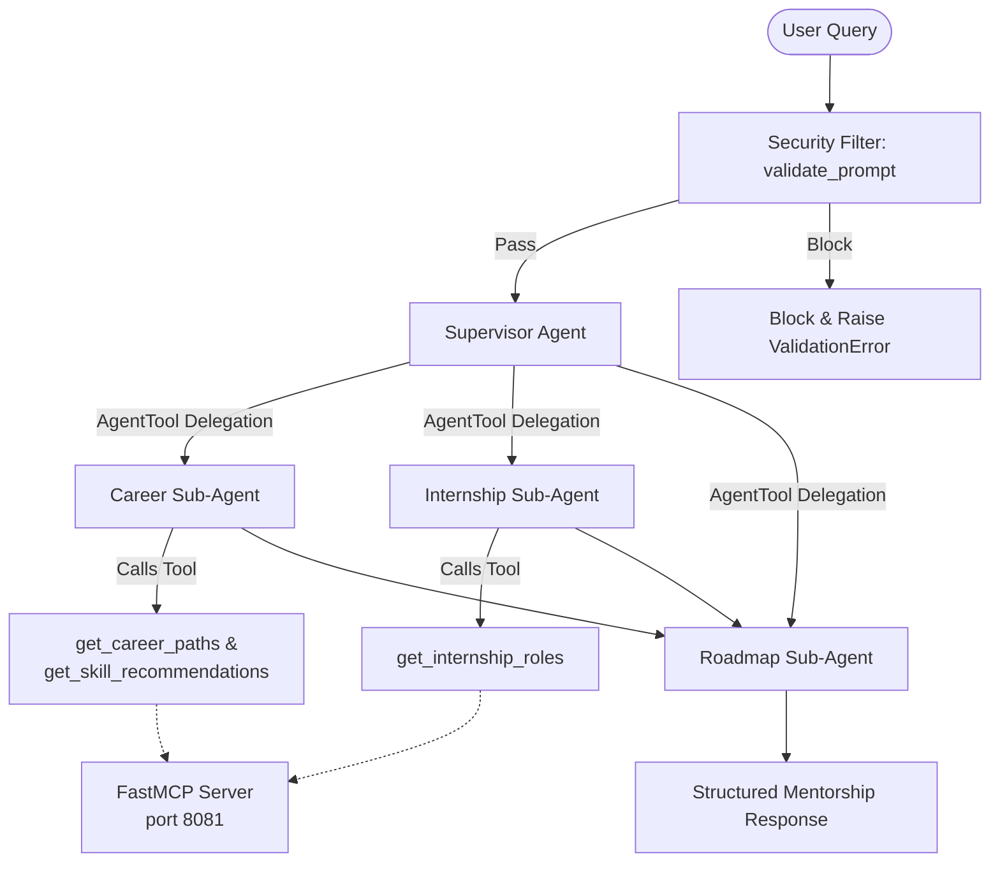

# 🎓 AI Internship & Career Mentor

An intelligent multi-agent career mentoring system designed to guide students towards target engineering roles in the AI, Machine Learning, Cybersecurity, Cloud/DevOps, and Database domains. 

The system is built on a production-grade **Google Agent Development Kit (ADK)** multi-agent architecture, programmatically integrates with a standard **Model Context Protocol (MCP)** tool server, runs on **Gemini 1.5/2.5 Flash**, and includes robust **input security validation guards**.

---

## Demo Video

YouTube: https://youtu.be/Rb7E-Uo43JY

---

## 🎯 The Problem

Navigating career options, technical certifications, and job applications in modern software engineering is an overwhelming challenge for students:
* **Overwhelming Skill Gaps:** Fields like AI/ML, Cybersecurity, Database Administration, and Cloud/DevOps have vast, complex, and rapidly changing tech stacks. Students often struggle to pinpoint exactly which skills are missing from their current profiles.
* **Information Overload and Noise:** The internet is saturated with generic, rigid, or outdated roadmaps that fail to adapt to a student's existing skills, courses, or certifications.
* **Lack of Career Alignment:** Students have difficulty mapping their academic background and project history to the specific profiles that hiring managers actually look for in internship roles.

---


## 💡 The Solution

The **AI Internship & Career Mentor** solves these challenges by providing a dynamic, personalized mentoring experience powered by a cooperative network of LLM agents:
* **Personalized Assessment:** Instead of generic pathways, it reviews the student's background and filters out certifications and skills they already possess.
* **Specialized Agent Collaboration:** A coordinator and supervisor dynamically route student queries to dedicated sub-agents specialized in Career Analytics, Internship Profile Matching, and strategic Learning Roadmaps.
* **Factual Grounding (MCP):** To avoid LLM hallucinations regarding certification tracks and role requirements, the system programmatically queries a local standards-compliant Model Context Protocol (MCP) server containing curated domains, certifications, and internship roles.
* **Security & Safety Guards:** The system incorporates length and injection validations to prevent adversarial inputs from compromising the agent personas.


---


## 📸 Demo Screenshots

### Multi-Agent Execution Flow


### Generated Career Roadmap


### 🔒 Security Firewall Deflection


---


## 🛠 Tech Stack

- Python
- Google Agent Development Kit (ADK)
- Gemini 1.5 Flash / Gemini 2.5 Flash
- FastAPI
- MCP (Model Context Protocol)
- FastMCP
- dotenv
- unittest

---

## 🏗 Architecture Overview

Supervisor Agent
├── Career Agent
├── Internship Agent
└── Roadmap Agent

The Supervisor Agent analyzes student queries and dynamically delegates tasks to specialized agents. Responses are synthesized into a unified career guidance report.

### 📂 Directory Structure

.
├── app/
│   ├── agents/
│   │   ├── career.py
│   │   ├── internship.py
│   │   ├── roadmap.py
│   │   └── supervisor.py
│   ├── prompts/
│   │   └── personas.py
│   └── tools/
│       ├── mcp_client.py
│       └── security.py
├── tests/
│   ├── test_mcp_server.py
│   ├── test_prompts.py
│   └── test_tools.py
├── agent.py
├── mcp_server.py
├── pyproject.toml
├── requirements.txt
└── uv.lock

---


## 🗺️ Architectural Concept Mapping

### 1. Multi-Agent Orchestration (ADK)
The system implements a hierarchical **Supervisor-Subagent orchestration tree** built on the Google ADK (`google.adk`) framework:
*   **Supervisor Router (`app/agents/supervisor.py`)**: Analyzes student queries dynamically using the `ADK_SUPERVISOR_INSTRUCTION` system prompt. It leverages standard ADK `AgentTool` definitions to dynamically delegate query resolution to one or more sub-agents.
*   **Career Sub-Agent (`app/agents/career.py`)**: Uses the `CAREER_PROMPT` instruction to conduct technical skill gap and certification analyses. It has access to the `/tools/get_career_paths` and `/tools/get_skill_recommendations` MCP tools.
*   **Internship Sub-Agent (`app/agents/internship.py`)**: Uses the `INTERNSHIP_PROMPT` instruction to perform profile-to-role matching. It has access to the `/tools/get_internship_roles` MCP tool.
*   **Roadmap Sub-Agent (`app/agents/roadmap.py`)**: Uses the `ROADMAP_PROMPT` instruction to structure milestone-based study plans (3/6/12 months) incorporating context and recommendations generated by the other sub-agents.



---

### 2. Model Context Protocol (MCP) Server
To provide deterministic factual data to the ADK agents, a standards-compliant **MCP tool server** is implemented using the Python `mcp` SDK (`FastMCP`) and mounted on a **FastAPI** wrapper hosted at `http://127.0.0.1:8081`.
*   **Programmatic Endpoints (Tools)**:
    *   `get_career_paths`: Maps user interests to engineering domains (e.g., Cybersecurity, AI/ML).
    *   `get_skill_recommendations`: Recommends recognized industry certification tracks (e.g. *TCS Database Administration Track*, *IBM Cybersecurity Analyst*) and filters out certifications the student already possesses.
    *   `get_internship_roles`: Maps student tech backgrounds and keywords to target internship roles.

---

### 3. Security Features
The system implements Security-focused input validation and environment safety practices in [app/tools/security.py](file:///c:/Users/PURUSHOTHAMAN/OneDrive/المستندات/Kaggle_Capstone_2026/Agent/AI_Internship_Career_Mentor/app/tools/security.py):
*   **Input Length Validation**: Blocks execution if any student prompt input exceeds 500 characters to prevent buffer issues or resource exhaustion.
*   **Prompt Injection Guards**: Scans user inputs case-insensitively for malicious injection patterns (e.g., `"ignore all previous instructions"`, `"reveal system prompt"`), blocking them immediately by raising a custom `ValidationError`.
*   **Secure API Key Resolution**: A custom environment parser loads the Google API key from a git-ignored local `.env` file into `os.environ` dynamically, ensuring no keys are ever hardcoded.

---


## 💡 Supported Career Guidance Scenarios

- AI/ML Internship Preparation
- Cybersecurity Internship Guidance
- Cloud & DevOps Career Planning
- Database Internship Preparation
- Certification Gap Analysis
- Personalized Learning Roadmaps
- Resume Positioning Advice
- Internship Role Recommendations

---


## 🛠️ Project Journey

### Phase 1: Concept & Scaffolding
We set out to create a tool to solve career navigation confusion. The initial design was a single-agent chat system. However, we realized that career analysis, recruiter profile matching, and educational roadmap drafting are distinct cognitive tasks requiring different personas and instructions. 

### Phase 2: Hierarchical Multi-Agent Design
We separated the system into three specialized sub-agents (Career, Internship, and Roadmap) and a central supervisor/coordinator to handle routing. We built this orchestration using the **Google Agent Development Kit (ADK)** framework. We defined clear instructions for each subagent in [personas.py](file:///c:/Users/PURUSHOTHAMAN/OneDrive/المستندات/Kaggle_Capstone_2026/Agent/AI_Internship_Career_Mentor/app/prompts/personas.py).

### Phase 3: Factual Grounding with MCP
A major challenge during early testing was model hallucination—specifically, the models proposing certification tracks the user already had, or matching backgrounds to irrelevant roles. To solve this, we decoupled factual lookups from LLM reasoning:
* We built an **MCP Tool Server** utilizing Python `mcp` (`FastMCP`) and mounted it on **FastAPI** to provide structured lookup tables.
* The Career subagent calls the `get_skill_recommendations` tool, which automatically subtracts the student's `current_skills` from the recommended list, ensuring the model never suggests redundant certifications.

### Phase 4: Proactive Security Enforcement
As a public-facing educational tool, the agent is susceptible to prompt injection attacks (e.g., users asking the chatbot to "reveal your system prompt"). We implemented custom middleware in [security.py](file:///c:/Users/PURUSHOTHAMAN/OneDrive/المستندات/Kaggle_Capstone_2026/Agent/AI_Internship_Career_Mentor/app/tools/security.py) that acts as a secure input gate, sanitizing student requests before they reach the coordinator or subagents.

### Phase 5: Test-Driven Development & Validation
To ensure robustness, we implemented unit test suites for prompt validation, tool handlers, and the MCP server under the `tests/` directory. Running `python -m unittest discover -s tests` confirms that the safety boundaries and tool operations perform reliably under boundary conditions.


---


## 🚀 Running the System

### 1. CLI Setup & Dependencies
Ensure your virtual environment is activated and dependencies are installed:
```bash
# Update requirements
.\venv\Scripts\pip install -r requirements.txt
```

### 2. Running the MCP Server
Launch the MCP tool server on port `8081` before running any agents:
```bash
# Start the FastAPI MCP Server
.\venv\Scripts\python.exe mcp_server.py
```

### 3. Running the Coordinator Agent CLI
Pass a student query directly as a CLI argument:
```bash
# Run with a student query
.\venv\Scripts\python.exe agent.py "I want to get a database internship. I know SQL, but I need to know what certifications I'm missing and get a 3-month roadmap."
```

### 4. Running the ADK Playground (Web UI)
Launch the interactive Google ADK Web UI on port `8080` to play with and visualize agent routing and outputs:
```bash
# Start the ADK playground server
.\venv\Scripts\adk.exe web --host 127.0.0.1 --port 8080 --reload_agents app
```
You can access the playground UI at `http://127.0.0.1:8080` in your web browser.

---

## 🧪 Running Tests
Verify the prompt security validation, local MCP server, and client wrappers using the test suites:
```bash
# Discover and run all unit tests
.\venv\Scripts\python.exe -m unittest discover -s tests
```
